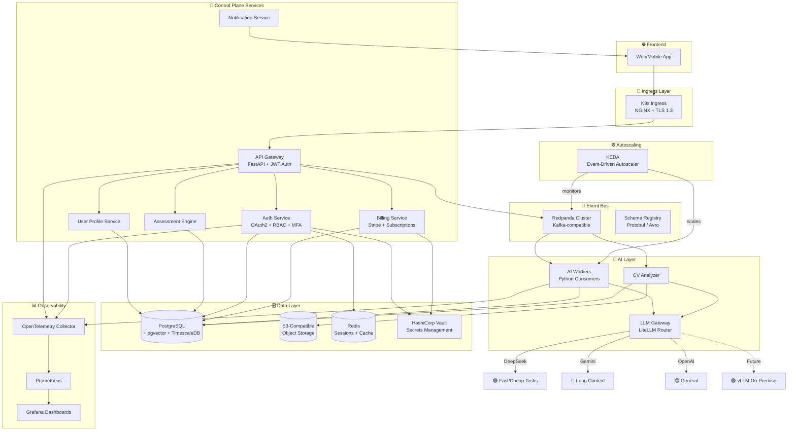
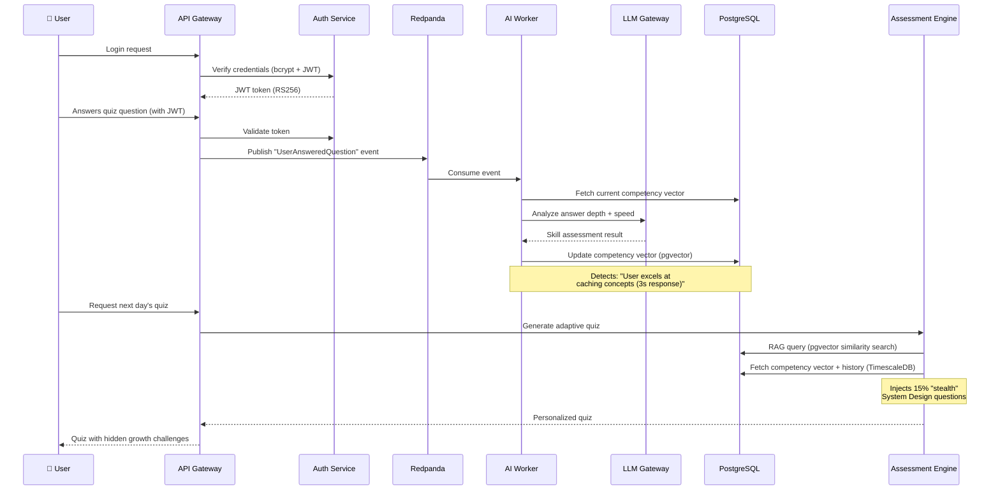

<h1 align="center">⚒️ SkillForge</h1>

<p align="center">
  <strong>An AI-Powered, Data-Intensive Career Learning Platform</strong><br/>
  <em>Built from scratch, Kubernetes-native, event-driven — inspired by "Designing Data-Intensive Applications" v2</em>
</p>

<p align="center">
  
  
  
  
  
  
  
  
</p>

---

## 🎯 What Is SkillForge?

**SkillForge** is a production-grade, data-intensive platform that personalizes tech career acceleration using AI. It analyzes a user's skills via adaptive assessments and CV analysis, then builds a dynamic, personalized learning path — evolving in real time as the user grows.

The system is **not** a simple CRUD app. It is an **engineering showcase** implementing the deepest patterns from Martin Kleppmann's *"Designing Data-Intensive Applications"* (2nd Edition), including:

- ✅ **Event Sourcing** — every state change is an immutable event
- ✅ **Stream Processing** (Kappa Architecture) — single real-time pipeline, no batch jobs
- ✅ **CQRS** — separate read/write models for optimal performance
- ✅ **Schema Evolution** — Protobuf/Avro schemas with versioning
- ✅ **Derived Data & Materialized Views** — competency vectors computed from event streams
- ✅ **Exactly-once Semantics** — idempotent consumers + transactional outbox
- ✅ **Tunable Consistency** — strong for auth/billing, eventual for analytics
- ✅ **Bank-Level Security** — rootless Podman, mTLS, encryption at rest + transit, GDPR
- ✅ **Fault Tolerance** — circuit breakers, dead-letter queues, exponential backoff

---

## 🔐 Security Architecture (Bank-Level)

SkillForge is designed to meet **financial-grade security requirements**:

| Layer | Implementation |
|-------|----------------|
| **Container Runtime** | Podman (rootless, daemonless, no root daemon attack surface) |
| **Encryption in Transit** | TLS 1.3 everywhere, mTLS between services (cert-manager) |
| **Encryption at Rest** | PostgreSQL + OS-level encryption, encrypted S3 buckets |
| **Authentication** | OAuth2/OIDC, JWT (RS256 asymmetric), bcrypt (cost 12+), MFA-ready |
| **Authorization** | RBAC (admin/learner/premium), K8s RBAC, network policies |
| **Secrets** | HashiCorp Vault (or Sealed Secrets), never in code or env files |
| **Audit** | Immutable audit log of all user actions and data access events |
| **Privacy (GDPR)** | Right to erasure, data export, consent management, data minimization |
| **Network** | Zero-trust pod-to-pod (deny-all default, explicit allow-list) |
| **Image Security** | Trivy vulnerability scanning in CI, read-only root filesystem |
| **Rate Limiting** | Per-user + per-IP rate limiting, brute-force login protection |

---

## 🏗️ System Architecture



---

## 🧬 How It Works: The "Stealth Learning" Engine



---

## 💰 Business Model & Subscription Tiers

| Tier | Price | Features |
|------|-------|----------|
| **Free** | €0/month | 5 quizzes/day, basic learning path, no CV analysis |
| **Pro** | €9.99/month or €99/year | Unlimited quizzes, full learning path, CV analysis, progress analytics |
| **Enterprise** | €29.99/month or €299/year | Everything in Pro + team management, priority AI, custom learning paths |

Revenue model ensures system costs are covered by subscriptions. LLM costs are optimized by the Gateway routing cheap tasks to DeepSeek.

---

## 🛠️ Tech Stack (100% Open-Source Where Possible)

| Layer | Technology | License | Why |
|-------|-----------|---------|-----|
| **Containers** | Podman | Apache 2.0 | Rootless, daemonless, K8s-native, FREE |
| **API** | FastAPI (Python) | MIT | Async, high-performance, OpenAPI auto-docs |
| **Event Bus** | Redpanda | BSL → Apache 2.0 | Kafka-compatible, 10x lower latency, single binary |
| **AI Router** | LiteLLM | MIT | Unified interface to 100+ LLMs, fallback, cost tracking |
| **Database** | PostgreSQL + pgvector + TimescaleDB | PostgreSQL + Apache 2.0 | Hybrid: relational + vector (RAG) + time-series |
| **Cache/Sessions** | Redis (or Valkey) | BSD / BSD | Session storage, token blacklisting, caching |
| **Object Storage** | MinIO | AGPL v3 | S3-compatible, CVs and learning materials |
| **Orchestration** | Kubernetes | Apache 2.0 | Auto-scaling, self-healing |
| **Autoscaler** | KEDA | Apache 2.0 | Scale-to-zero, event-driven scaling |
| **Secrets** | HashiCorp Vault | BSL | Bank-level secrets management |
| **Payments** | Stripe API | — | PCI-compliant payment processing |
| **Schema Registry** | Redpanda Schema Registry | BSL | Protobuf/Avro schema evolution |
| **Observability** | OpenTelemetry + Prometheus + Grafana | Apache 2.0 | Tracing, metrics, dashboards |
| **CI/CD** | GitHub Actions | — | Lint, test, build, deploy pipeline |
| **IaC** | Terraform + Kustomize | BSL + Apache 2.0 | Cloud infra + K8s manifest management |
| **Image Scanning** | Trivy | Apache 2.0 | Container vulnerability scanning |

---

## 📁 Repository Structure

```
skillforge/
├── 📄 README.md                    # Project overview (you are here)
├── 📄 PERSONAL_GUIDE.md            # Zero-to-hero manual (for you)
├── 📄 AI_CONTEXT.md                # AI assistant context file
├── 📄 ROADMAP.md                   # Step-by-step implementation guide
├── 📄 CONTRIBUTING.md              # Contribution guidelines
│
├── 🔧 services/                    # Microservices (9 total)
│   ├── api-gateway/                # Public REST/WebSocket API
│   ├── auth-service/               # OAuth2, JWT, RBAC, MFA
│   ├── billing-service/            # Stripe, subscriptions, invoices
│   ├── llm-gateway/                # LiteLLM model router
│   ├── ai-worker/                  # Event consumer + AI processing
│   ├── assessment-engine/          # Adaptive quiz generation (RAG)
│   ├── user-profile-service/       # User domain management
│   ├── cv-analyzer/                # CV parsing + skill extraction
│   └── notification-service/       # Push/email/in-app notifications
│
├── 📡 events/                      # Event definitions
│   ├── schemas/                    # Protobuf/Avro event schemas
│   └── topics.yaml                 # Redpanda topic configuration
│
├── 🗄️ database/                    # Database layer
│   ├── migrations/                 # Alembic SQL migrations
│   ├── seeds/                      # Development seed data
│   └── schema.sql                  # Reference schema
│
├── ☸️ infra/                        # Infrastructure as Code
│   ├── k8s/                        # Kubernetes manifests (Kustomize)
│   ├── helm/                       # Helm values for 3rd-party charts
│   ├── containers/                 # Containerfiles + podman-compose
│   └── terraform/                  # Cloud infrastructure modules
│
├── 📊 observability/               # Monitoring & tracing
├── 📚 libs/py-common/              # Shared Python utilities
├── 📖 docs/                        # ADRs, API specs, runbooks
└── 🔄 .github/workflows/          # CI/CD pipelines
```

---

## 🗃️ Database Design (Hybrid PostgreSQL)

### Core Tables

| Table | Engine | Purpose |
|-------|--------|---------|
| `users` | Relational | Core user data, auth, preferences |
| `user_credentials` | Relational | Hashed passwords, MFA secrets (encrypted) |
| `user_sessions` | Redis | Active sessions, refresh tokens |
| `competency_vectors` | pgvector | Skill embeddings per user (1536-dim) |
| `assessments` | Relational | Quiz definitions and results |
| `learning_materials` | pgvector | Chunked content with embeddings (RAG) |
| `learning_paths` | Relational | Personalized paths |
| `user_progress` | TimescaleDB | Time-series: scores, engagement |
| `subscriptions` | Relational | User subscription state, tier, billing cycle |
| `invoices` | Relational | Payment history, Stripe references |
| `audit_log` | TimescaleDB | Immutable audit trail (GDPR) |
| `events_outbox` | Relational | Transactional outbox pattern |
| `gdpr_consent` | Relational | User consent records |

---

## 📚 DDIA v2 Chapters → SkillForge Implementation

| Chapter | Concept | Implementation |
|---------|---------|----------------|
| Ch1 | Trade-offs | ADRs for every architectural choice |
| Ch2 | Non-functional Requirements | SLOs: p99 < 100ms API, 99.9% uptime |
| Ch3 | Data Models & Query Languages | Hybrid PostgreSQL (relational + vector + time-series) |
| Ch4 | Storage & Retrieval | IVFFlat/HNSW indexes, B-tree, TimescaleDB compression |
| Ch5 | Encoding & Evolution | Protobuf schemas, backward/forward compatible |
| Ch6 | Replication | PostgreSQL streaming replication, Redpanda 3x replication |
| Ch7 | Sharding | Redpanda partitioning by user_id |
| Ch8 | Transactions | ACID for billing/auth, transactional outbox |
| Ch9 | Distributed Systems | Circuit breakers, retries, DLQ, timeout budgets |
| Ch10 | Consistency & Consensus | Strong for auth/billing, eventual for analytics |
| Ch11 | Batch Processing | TimescaleDB continuous aggregates, periodic reports |
| Ch12 | Stream Processing | Kappa arch — all processing via Redpanda |
| Ch13 | Streaming Philosophy | Event sourcing as source of truth, derived views |
| Ch14 | Doing the Right Thing | GDPR, data privacy, ethical AI, user consent |

---

## 🚀 Getting Started

> ⚠️ **This project is under active development.** See [ROADMAP.md](ROADMAP.md) for current progress.

### Prerequisites
- **Podman** & podman-compose
- Python 3.12+
- kubectl + helm (for K8s deployment)
- At least one LLM API key (DeepSeek, OpenAI, or Google)

### Local Development (Podman Compose)
```bash
# Clone the repository
git clone https://github.com/Mohamed-DN/skillforge.git
cd skillforge

# Copy environment template
cp .env.example .env
# Edit .env with your API keys and secrets

# Start all infrastructure services
podman-compose -f infra/containers/podman-compose.yml up -d

# Run database migrations
podman exec skillforge-api alembic upgrade head

# Open the API docs
open http://localhost:8000/docs
```

---

## 🤝 Contributing

See [CONTRIBUTING.md](CONTRIBUTING.md) for guidelines.

## 📜 License

This project is licensed under the MIT License.

---

<p align="center">
  <em>Built with ⚒️ as a learning journey — from zero to production-grade, bank-level data-intensive system.</em><br/>
  <em>Every line of code implements a concept from "Designing Data-Intensive Applications" v2.</em>
</p>
