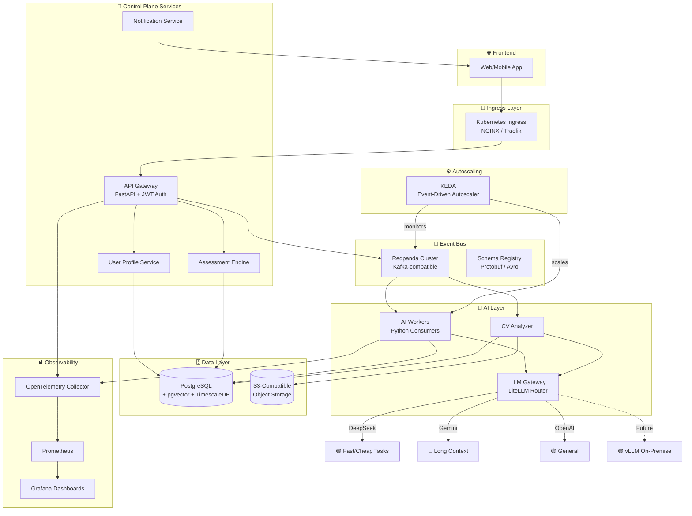
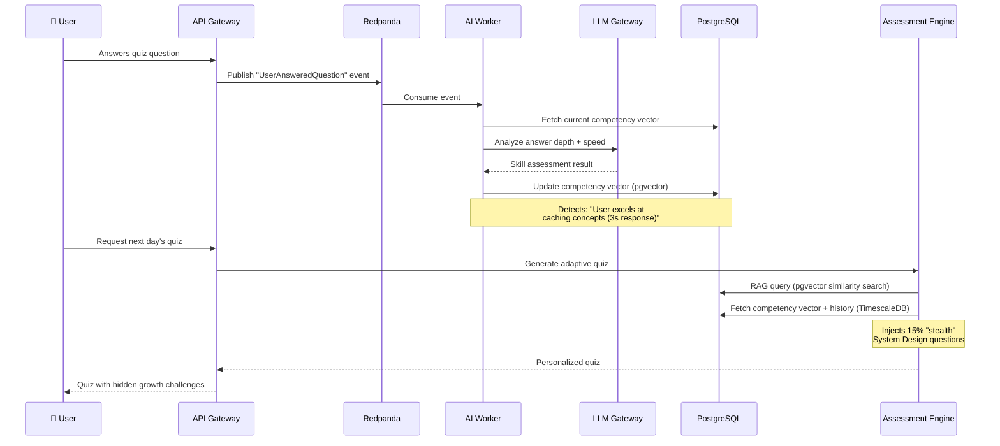

<h1 align="center">🧠 Megaproject</h1>

<p align="center">
  <strong>An AI-Powered, Data-Intensive Career Learning Platform</strong><br/>
  <em>Built from scratch, Kubernetes-native, event-driven — inspired by "Designing Data-Intensive Applications" v2</em>
</p>

<p align="center">
  
  
  
  
  
  
</p>

---

## 🎯 What Is This?

**Megaproject** is a production-grade, data-intensive platform that personalizes tech career acceleration using AI. It analyzes a user's skills via adaptive assessments and CV analysis, then builds a dynamic, personalized learning path — evolving in real time as the user grows.

The system is **not** a simple CRUD app. It is an **engineering showcase** implementing the deepest patterns from Martin Kleppmann's *"Designing Data-Intensive Applications"* (2nd Edition), including:

- ✅ **Event Sourcing** — every state change is an immutable event
- ✅ **Stream Processing** (Kappa Architecture) — single real-time pipeline, no batch jobs
- ✅ **CQRS** — separate read/write models for optimal performance
- ✅ **Schema Evolution** — Protobuf/Avro schemas with versioning
- ✅ **Derived Data & Materialized Views** — competency vectors computed from event streams
- ✅ **Exactly-once Semantics** — idempotent consumers + transactional outbox
- ✅ **Tunable Consistency** — strong for assessments, eventual for analytics
- ✅ **Fault Tolerance** — circuit breakers, dead-letter queues, exponential backoff

---

## 🏗️ System Architecture



---

## 🧬 How It Works: The "Stealth Learning" Engine



### The Lifecycle

1. **Assessment** — User takes adaptive quizzes; answers are events streamed to Redpanda
2. **AI Analysis** — Workers consume events, call the LLM Gateway to analyze response depth
3. **Competency Update** — The user's skill vector (stored as a pgvector embedding) is updated in real time
4. **RAG-Powered Path** — Next quiz uses vector similarity search to find relevant learning materials, cross-referenced with the updated competency profile
5. **Stealth Growth** — The system silently injects questions from adjacent domains (e.g., System Design for a Frontend dev) to broaden skills without overwhelming

---

## 🛠️ Tech Stack

| Layer | Technology | Why |
|-------|-----------|-----|
| **API** | FastAPI (Python) | Async, high-performance, OpenAPI auto-docs |
| **Event Bus** | Redpanda | Kafka-compatible, 10x lower latency, single binary, no JVM/ZooKeeper |
| **AI Router** | LiteLLM | Unified interface to 100+ LLMs, model fallback, cost tracking |
| **Database** | PostgreSQL + pgvector + TimescaleDB | Hybrid: relational + vector search (RAG) + time-series analytics |
| **Object Storage** | S3-compatible (MinIO local) | CVs, documents, learning materials |
| **Orchestration** | Kubernetes | Auto-scaling, self-healing, declarative infrastructure |
| **Autoscaler** | KEDA | Scale-to-zero, event-driven scaling based on Redpanda consumer lag |
| **Schema Registry** | Redpanda Schema Registry | Protobuf/Avro schema evolution and compatibility |
| **Observability** | OpenTelemetry + Prometheus + Grafana | Distributed tracing, metrics, dashboards |
| **CI/CD** | GitHub Actions | Lint, test, build, deploy pipeline |
| **IaC** | Terraform + Kustomize | Cloud infra provisioning + K8s manifest management |

---

## 📁 Repository Structure

```
Megaproject/
├── 📄 README.md                    # You are here
├── 📄 AI_CONTEXT.md                # AI assistant context file
├── 📄 ROADMAP.md                   # Step-by-step implementation guide
├── 📄 CONTRIBUTING.md              # Contribution guidelines
├── 📄 .gitignore
│
├── 🔧 services/                    # Microservices
│   ├── api-gateway/                # Public REST/WebSocket API
│   ├── llm-gateway/                # LiteLLM model router
│   ├── ai-worker/                  # Event consumer + AI processing
│   ├── assessment-engine/          # Adaptive quiz generation
│   ├── user-profile-service/       # User domain management
│   ├── cv-analyzer/                # CV parsing + skill extraction
│   └── notification-service/       # Push/email/in-app notifications
│
├── 📡 events/                      # Event definitions
│   ├── schemas/                    # Protobuf/Avro event schemas
│   └── topics.yaml                 # Redpanda topic configuration
│
├── 🗄️ database/                    # Database layer
│   ├── migrations/                 # Alembic SQL migrations
│   ├── seeds/                      # Development seed data
│   └── schema.sql                  # Reference schema
│
├── ☸️ infra/                        # Infrastructure as Code
│   ├── k8s/                        # Kubernetes manifests
│   │   ├── base/                   # Base resources
│   │   └── overlays/               # Kustomize overlays (dev/prod)
│   ├── helm/                       # Helm values for 3rd-party charts
│   ├── docker/                     # Dockerfiles + docker-compose
│   └── terraform/                  # Cloud infrastructure modules
│
├── 📊 observability/               # Monitoring & tracing
│   ├── dashboards/                 # Grafana dashboard JSON
│   ├── alerts/                     # Prometheus alert rules
│   └── otel/                       # OpenTelemetry collector config
│
├── 📚 libs/                        # Shared libraries
│   └── py-common/                  # Common Python utilities
│
├── 📖 docs/                        # Documentation
│   ├── architecture/               # ADRs (Architecture Decision Records)
│   ├── api/                        # OpenAPI specs
│   └── runbooks/                   # Operational runbooks
│
└── 🔄 .github/
    └── workflows/                  # CI/CD pipelines
```

---

## 🗃️ Database Design (Hybrid PostgreSQL)

The database uses PostgreSQL as a **single unified engine** with extensions:

- **pgvector** — stores competency embeddings (1536-dim vectors) for semantic similarity search (RAG)
- **TimescaleDB** — stores time-series data (learning progress, response times, engagement metrics)
- **Standard relational** — users, assessments, learning materials, configurations

### Key Tables

| Table | Engine | Purpose |
|-------|--------|---------|
| `users` | Relational | Core user data, auth, preferences |
| `competency_vectors` | pgvector | Skill embeddings per user (updated by AI workers) |
| `assessments` | Relational | Quiz definitions and results |
| `learning_materials` | pgvector | Chunked learning content with embeddings (for RAG) |
| `learning_paths` | Relational | Generated personalized paths |
| `user_progress` | TimescaleDB | Time-series: response times, scores, engagement |
| `events_outbox` | Relational | Transactional outbox for exactly-once event publishing |

---

## 🧠 LLM Gateway: Intelligent Model Routing

The LLM Gateway is **invisible to the end user** — it dynamically routes AI tasks based on cost and capability:

| Task Type | Routed To | Why |
|-----------|----------|-----|
| Quiz generation (simple) | **DeepSeek** | Fast, cheap, excellent for structured output |
| CV analysis (long doc) | **Google Gemini** | 1M+ token context window |
| Skill assessment reasoning | **OpenAI GPT** | Strong general reasoning |
| Future on-premise | **vLLM (Llama/Mistral)** | Zero marginal cost, full data control |

Switching providers requires **zero code changes** — just update the LiteLLM config.

---

## 🚀 Getting Started

> ⚠️ **This project is under active development.** See [ROADMAP.md](ROADMAP.md) for current progress.

### Prerequisites
- Docker & Docker Compose
- Python 3.12+
- kubectl + helm (for K8s deployment)
- Access to at least one LLM API key (DeepSeek, OpenAI, or Google)

### Local Development (Docker Compose)
```bash
# Clone the repository
git clone https://github.com/YOUR_USERNAME/megaproject.git
cd megaproject

# Copy environment template
cp .env.example .env
# Edit .env with your API keys

# Start all services
docker compose -f infra/docker/docker-compose.yml up -d

# Run database migrations
docker compose exec api-gateway alembic upgrade head

# Open the API docs
open http://localhost:8000/docs
```

### Kubernetes Development (Minikube/Kind)
```bash
# Start local cluster
minikube start --cpus=4 --memory=8192

# Install dependencies
helm install redpanda redpanda/redpanda -f infra/helm/redpanda-values.yaml
helm install postgresql bitnami/postgresql -f infra/helm/postgres-values.yaml
helm install keda kedacore/keda

# Deploy services
kubectl apply -k infra/k8s/overlays/dev/
```

---

## 📚 DDIA v2 Concepts Implemented

This project is a **living implementation** of concepts from *"Designing Data-Intensive Applications"* (2nd Edition, Kleppmann & Riccomini). Here's the mapping:

| DDIA v2 Chapter/Concept | Implementation |
|---|---|
| Trade-offs in Data Systems | OLTP (PostgreSQL) vs analytics (TimescaleDB) separation |
| Defining Non-functional Requirements | SLOs per service (see `/docs/architecture/`) |
| Data Encoding & Schema Evolution | Protobuf schemas with backward/forward compatibility |
| Replication & Partitioning | Redpanda topic partitioning by `user_id` |
| Stream Processing | Kappa architecture — all processing via Redpanda consumers |
| Event Sourcing | Immutable event log as source of truth |
| Derived Data & Materialized Views | Competency vectors derived from event streams |
| The Trouble with Distributed Systems | Circuit breakers, retries, dead-letter queues |
| Consistency & Consensus | Strong consistency for assessments, eventual for analytics |
| Cloud-native & Object Storage | S3 for documents, K8s for compute |

---

## 🤝 Contributing

See [CONTRIBUTING.md](CONTRIBUTING.md) for guidelines.

## 📜 License

This project is licensed under the MIT License.

---

<p align="center">
  <em>Built with 🔥 as a learning journey — from zero to production-grade data-intensive system.</em>
</p>
